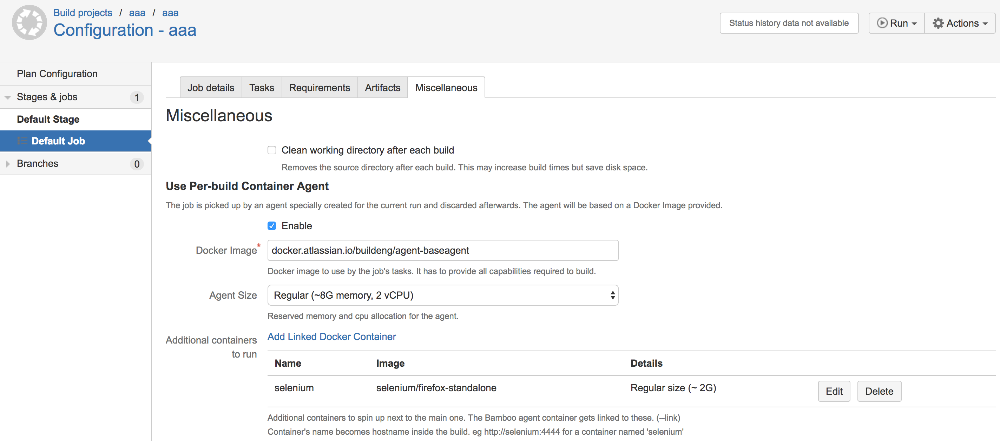
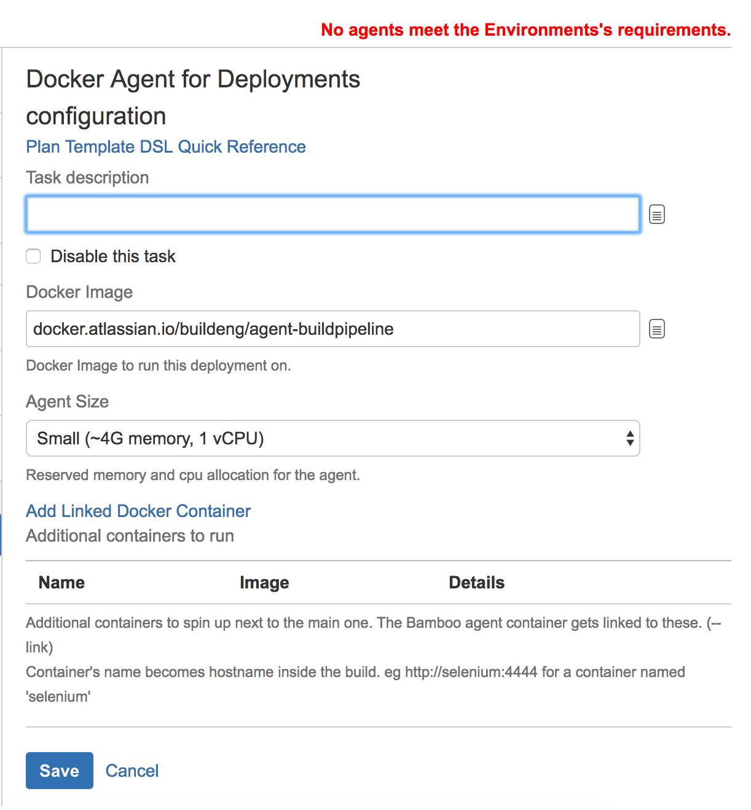
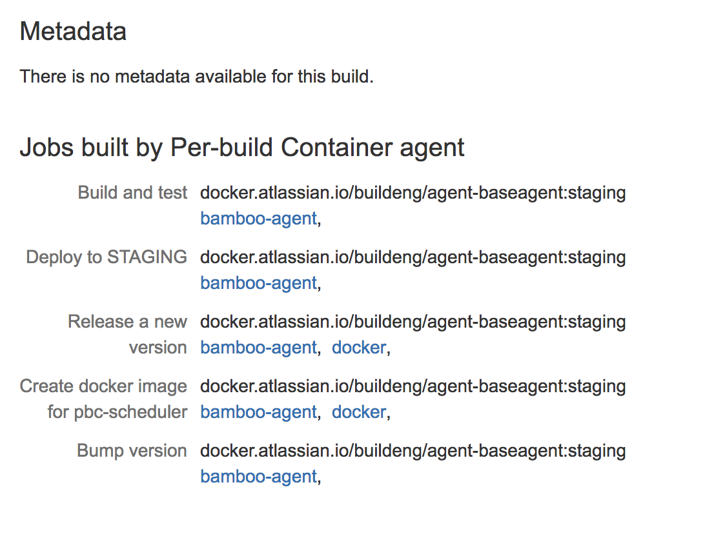

What is this?
=====

This is an Atlassian Bamboo plugin that provides the general UI and shared functionality for per-build containers
without links to specific Docker clustering backend. See the parent [README.md](../README.md) for general description of the functionality.

Usage
=====
To run individual Bamboo plan's jobs on per-build-container agents,
go to Job's Miscellaneous tab, enable it and select a Docker image to use.

The base image is mandatory, next to it you can also define several side/extra containers for services
that will be provided to the agent itself. What are such services?

* Database like postgres, mysql, mariadb that your build tests against
* Selenium [selenium/standalone-firefox](https://hub.docker.com/r/selenium/standalone-firefox/) or [selenium/standalone-chrome](https://hub.docker.com/r/selenium/standalone-chrome/)
to run Webdriver/Selenium tests against.
* a [Docker daemon container](https://hub.docker.com/_/docker/) to enable running Docker commands inside the agent.
* any other service your build needs in order to run. We will recognize this

Please note that these services might need additional configuration in form of environment variable or commands that are to be passed in.

These services are referenced in the agent runtime by their name as hostname. So if your Selenium container is named 'selenium', you will refer to the Selenium server as
http://selenium:4444

A lot of these services will also need compatible client binaries on the main agent container, eg. docker cli, tools to access the database etc.

Example setup in Bamboo Job's Miscellaneous configuration section

Deployment environments can also be run by per-build container agents however since the only way to
customize a Deployment project environment is by adding tasks, there is a special task for this purpose
that only configures PBC and is a noop on the agent itself.

Once the build starts, we trigger a request for specified agent as per configuration. The backend plugin will make sure it's started and connects to the server.
Then the job is picked up and built. After finishing the build, the agent is removed and stopped.

We provide simple information about the images/configuration used to build the particular Job/Plan in their respective Build summary pages.
Apart from Docker images used, this can include additional information specific the  backend plugin used. Eg. For ECS backed agents,
 we provide the ECS Task ARN and container logs for some logging drivers used. We also show errors there if there were any problems
in creating the agent.

Caveats and gotchas
=======

Since the UI and entire functionality is created as part of a Bamboo plugin only, there are few suboptimal places in UI.

* The need for a task to configure PBC in Deployment projects is one (described above)
* The entire system of Job Requirements and Agent capabilities and the associated UI sort of breaks. We always create a build Agent
for each execution, it comes online, builds the job it's meant to build and gets removed immediately afterwards. The consequences are:
    - At the time of configuration, Bamboo knows nothing of the agent's capabilities, so it will often complain about 'No agent matching requirements'.
    - It will keep on complaining even after you start the build and it's still queued.
    - Sometimes when a same class of agents is building other similar jobs or branches of the same job, Bamboo will insist that your job can be built on X agents, yet it's still only queued. That's because we are waiting for the one right agent to pick up your job.
    - Some types of tasks' configuration UIs provide a selection comboboxes for JDK/Maven/Ant/Node/.. that is populated by the known agents' capabilities. We use Javascript hackery to turn these selection boxes into freeform textfields to be capable to configure PBC jobs.
* Once the agent finishes building, it's removed from the Bamboo server database. As a result, the bamboo job result page doesn't link to the agent page,like it does in case of Remote and Elastic agents. It does so during the build only.

