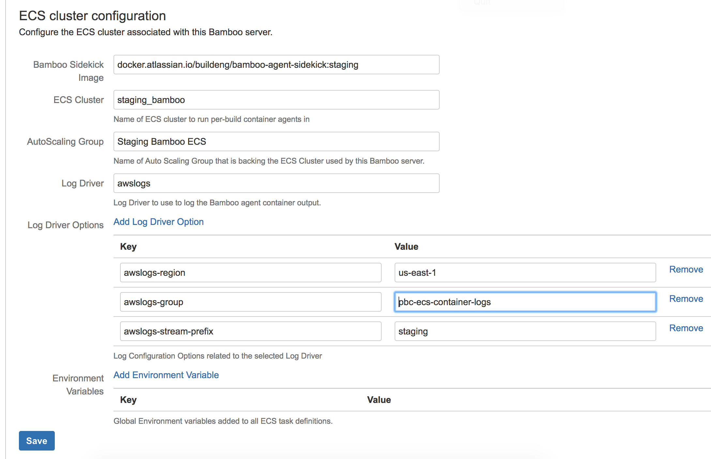

What is this?
=====

This is an Atlassian Bamboo plugin that provides per-build container Docker clustering backend based on Amazon ECS.
The plugin will schedule tasks on the cluster, scale it's autoscaling group etc.

 See the parent [README.md](../README.md) for general description of the functionality.

Usage
=====

__Please note that this plugin assumes that a single Amazon ECS cluster/Autoscaling Group is always just accessed and managed by one
Bamboo server only. So for each instance you want to run, you have to provision separate infrastructure__

__Important: The Bamboo server itself needs the AWS permissions as specified in [ecs-scheduler-service](../ecs-scheduler-service/README.md)__

If your Bamboo agents need to assume particular AIM roles, please make sure the role is part of the Autoscaling Group/Launch configuration setup.

__PBC ECS Backend__ administration panel at http://your_bamboo_instance/admin/viewDockerConfiguration.action
needs to be configured before first agents can be provisioned.

Mandatory fields:

* Bamboo Sidekick Image - name of the image to use as [sidekick](../sidekick/README.md) with jre + bamboo agent + additional bamboo/setup tools.
* ECS Cluster - name of the ECS cluster to be used to schedule tasks/agents
* AutoScaling Group - the name of the ASG associated with the ECS cluster

Optionally you can additionally configure the Docker Log driver and options and global environment variables to be passed to all Bamboo agent containers.

