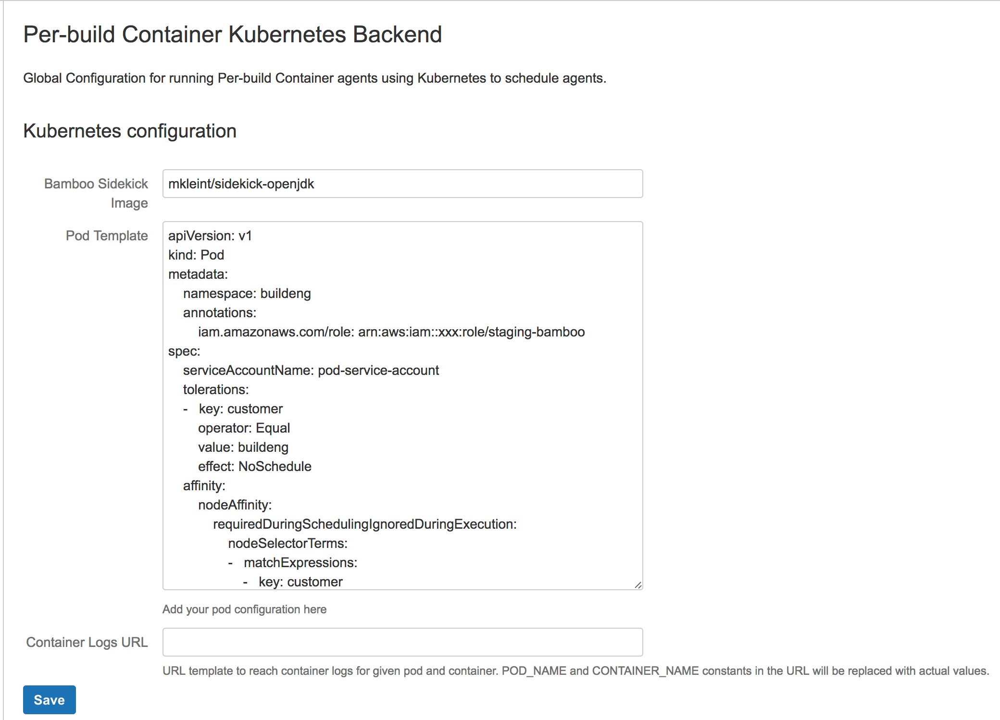

What is this?
=====

This is an Atlassian Bamboo plugin that provides per-build container Docker clustering backend based on existing
Kubernetes
cluster.
The plugin will schedule tasks on the cluster only, assumes the kube cluster itself handles scaling up and down.

See the parent [README.md](../README.md) for general description of the functionality.

Prerequisites
=====

* The bamboo server needs `kubectl` installed. The version you pick should likely be aligned with what version to
  choose.
  We have been running with 1.7.x and 1.9.3 successfully. The plugin is just creating/listing/deleting pods so should be
  mostly compatible across versions.
* User running the bamboo server needs the ~/.kube/config setup including the default context that will be used by the
  plugin.
  Example:

```
apiVersion: v1
clusters:
- cluster:
    certificate-authority: /home/ubuntu/.kube/buildeng-ca.crt
    server: https://kubernetes.cluster.us-east-1.example.com
  name: buildeng
contexts:
- context:
    cluster: buildeng
    namespace: buildeng
    user: buildeng
  name: buildeng
current-context: buildeng
kind: Config
preferences: {}
users:
- name: buildeng
  user:
    token: XXX
```

* Preexisting kubernetes cluster with automatic scaling, the Bamboo plugin itself only adds pods to the cluster, not
  scaling.
  We are using [escalator](https://github.com/atlassian/escalator) for scaling the cluster in AWS infrastructure.

* For per-plan/per-deployment AWS IAM Role to work in Kubernetes, the cluster has to
  run https://github.com/jtblin/kube2iam as service.
  The Bamboo plugin will only add relevant annotations (iam.amazonaws.com/role + iam.amazonaws.com/external-id) to the
  Kubernetes pod (https://github.com/jtblin/kube2iam#kubernetes-annotation)
  While role is configurable by user, external-id is generated per plan/deployment to uniquely identify the plan in
  question. That way only certain builds
  can be whitelisted to be able to assume given role.
  If a default fallback IAM role or plain one role per Bamboo server is required, it has to be defined as part of the
  Pod template global
  configuration. See below for example.

Usage
=====

__PBC Kubernetes Backend__ administration panel at http://your_bamboo_instance/admin/viewKubernetesConfiguration.action
needs to be configured before first agents can be provisioned.

The admin panel has 2 mandatory fields:

* definition of the sidekick image to use, please note that due to kube's inability to mount volumes from containers,
  the sidekick images needs to extend an image shell on it. Eg. NOT tianon/true that we used to use at one point in the
  past with ECS.

* A pod template with your environment's specific fields. These can include annotations, labels, affinity/toleration (if
  your cluster supports those)
  and so on. This template will be merged with the base pod definition generated by the plugin code.

Example pod template with annotations, custom scheduler, secrets volume and affinity/tolerations definitons:

```
apiVersion: v1
kind: Pod
metadata:
    namespace: buildeng
    annotations:
        iam.amazonaws.com/role: arn:aws:iam::xxxx:role/staging-bamboo
        atlassian.com/business_unit: xxx
spec:
    serviceAccountName: xxx
    schedulerName: buildeng
    tolerations:
    -   key: customer
        operator: Equal
        value: buildeng
        effect: NoSchedule
    affinity:
        nodeAffinity:
            requiredDuringSchedulingIgnoredDuringExecution:
                nodeSelectorTerms:
                -   matchExpressions:
                    -   key: customer
                        operator: In
                        values:
                        - buildeng
    volumes:
    -   name: secrets
        secret:
            secretName: staging-bamboo
    containers:
    -   name: bamboo-agent
        resources:
            limits:
                cpu: "40000m"
                memory: "178000m"
        volumeMounts:
        -   name: secrets
            mountPath: /buildeng-kube-secret

```

Optionally, if your kubernetes cluster is configured to send container logs to Splunk or similar log management
solutions,
you can define an URL template to link the container logs from the build result page.




Advanced and Miscellaneous
========

If you are running Prometheus in the cluster, you can make use of
the [PBC Kubernetes Metrics plugin](../bamboo-kubernetes-metrics-plugin/)
and collect per agent metrics via Prometheus.

To access AWS resources, we are running a combination of Kube secrets and https://github.com/jtblin/kube2iam as service
in our cluster and the Pod Template Bamboo configuration
includes the kube2iam annotations to have the agent container assume the given role per Bamboo server.
Per-plan/per-deployment AWS IAM Role is also supported since version 2.59 and relies on the same kube2iam service.


Running integration tests locally
========
To run integration tests locally, you need to prepare your environment first. Detailed instructions how to do it can be
found in: https://hello.atlassian.net/wiki/spaces/BAMBOO/pages/1536591697/Setup+Kubernetes+at+dev+environment.
In short, to run tests:

* if you're on macbook, ensure webdriver can resolve local host address:
    * webdriver tests use the macbook `serial number` for the local host address
    * click Apple Menu icon in the top left corner, and then click `About this mac`
    * copy the serial number (e.g. `C02DG123AB1C`)
    * add following line to the bottom of the `/etc/hosts` file
  ```
  127.0.0.1 <your serial number>
  ```
* install Docker Desktop & kubectl
* if you are a user of the KITT CLI, you will need to reset your `$KUBECONFIG`, as the CLI will point this to a
  different place
   ```shell
  # Prefix each command
  KUBECONFIG=$HOME/.kube/config kubectl your command here 
  
  # or export it once before running any commands
  export KUBECONFIG=$HOME/.kube/config
  ```
* configure kubectl to use Docker Desktop as the current context:
    ```shell
    kubectl config use-context docker-desktop
    ```
* create secret to pull images from docker.atl-paas.net:
    ```shell
    kubectl create secret docker-registry docker-atl-paas-registry --docker-server=docker.atl-paas.net --docker-username=<user> --docker-password=<API_KEY> --docker-email=<user@atlassian.com> --context docker-desktop
    ```
    * Get API key from https://packages.atlassian.com/ui/admin/artifactory/user_profile
* start bamboo:
    ```shell
    atlas-debug
    ```
* make sure that Bamboo `base` and `broker client` urls are not set to `localhost`, but use address accessible from a
  docker container (e.g. your local IP), so agents will be able to access server from a pod
    * you can configure the `base` and `broker client` urls in `Administration` > `System` > `General configuration`
* uncomment the `imagePullSecrets` property in the `src/test/resources/basePodTemplate.yaml` to use the secret for
  docker.atl-paas.net
* run `it.com.atlassian.buildeng.kubernetes.PbcSetupTest` (e.g. through Maven or your IDE, not through the wired test
  console in the Bamboo dev toolbox). It will configure PBC
  automatically for you
