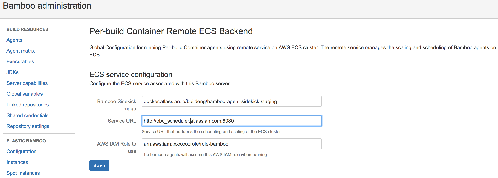

What is this?
=====

This is an Atlassian Bamboo plugin that provides the a backend talking to remote service that handles scaling and scheduling on ECS.
Useful to have multiple Bamboo servers pool and share a single ECS cluster to balance out the load.
 See the parent [README.md](../README.md) for general description of the functionality.

Usage
=====

When you install this plugin, it is assumed that you have an [ecs-scheduler-service](../ecs-scheduler-service/README.md) running someplace that handle
the scheduling of ECS tasks and scaling of ECS cluster. Please read it's documentation on how to set it up.

__PBC Remote Backend__ administration panel at http://your_bamboo_instance/admin/viewRemoteEcsConfiguration.action
needs to be configured before first agents can be provisioned. All fields are mandatory.

* Bamboo Sidekick Image - name of the image to use as [sidekick](../sidekick/README.md) with jre + bamboo agent + additional bamboo/setup tools.
* Service URL - Url to the [ecs-scheduler-service](../ecs-scheduler-service/README.md)
* AWS IAM Role - IAM role that the task will assume when running the bamboo agent. See related [ECS documentation](http://docs.aws.amazon.com/AmazonECS/latest/developerguide/task-iam-roles.html)

